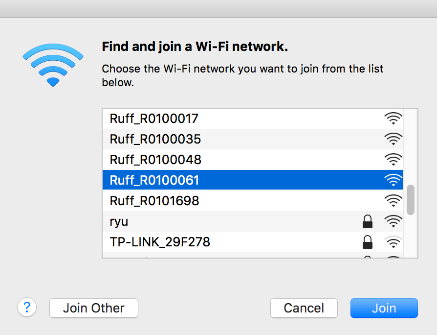

**注意：** 本文是为 Ruff 1.5.0 之后的版本准备的教程。如果你的固件是旧版本：

* 请访问[这里](http://community.ruff.io/t/ap-ruffos/469)，使用 AP 方式将固件升级到最新版本。

让我们开始自己的第一个 Ruff 项目：点亮板载 LED。

<video controls preload="none" poster="https://o18b6lfwd.qnssl.com/getting-started.jpg">
  <source src="https://o18b6lfwd.qnssl.com/Ruff_1.5-HD_1080p.mov" type="video/mp4">
</video>

# 前提条件

* 如果你还没有 Ruff 的开发套件，可以到[这里](https://shop154924108.taobao.com/)购买。
* 请确保自己的电脑具备无线网络访问能力。
* 在实践过程中，遇到任何问题，可以访问[疑难解决](https://ruff.io/zh-cn/docs/trouble-shooting.html)。

# 第一步：下载安装 Ruff SDK

1. 根据你的操作系统，下载并安装 [Ruff SDK](https://ruff.io/zh-cn/docs/download.html)。
2. 在安装完成后，在命令行中执行 `rap --version`，如果正确输出当前的 SDK 版本，则说明 Ruff SDK 安装成功。

> Ruff 的开发工具 `rap` 为 Ruff 应用开发提供了多方面的支持，包括项目脚手架，依赖与设备管理等。

# 第二步：创建 "Hello Ruff" 项目

使用命令行打开自己常用的项目文件夹，再逐行执行下列命令（不包括以 `#` 开头的注释）：

**注意**：请勿在 SDK 文件夹内新建项目。

```sh
# 新建项目文件夹
mkdir hello-ruff
# 进入项目文件夹
cd hello-ruff
# 初始化 Ruff 应用
rap init
```

请根据提示填写应用名称等内容（括号内表示默认值，如果和预期一致，可以直接回车确认）:

```
? app name: hello-ruff
? version: 0.1.0
? description: Hello, Ruff!
? author: Nanchao Inc.
```

完成后， `rap` 会初始化项目并下载开发板的配置信息及依赖。

# 第三步：应用开发

打开由 `rap` 自动生成的 `src/index.js` 文件：

```js
'use strict';

$.ready(function (error) {
    if (error) {
        console.log(error);
        return;
    }

    $('#led-r').turnOn();
});

$.end(function () {
    $('#led-r').turnOff();
});
```

这段代码的作用是在应用启动后点亮红色板载 LED（设备 ID 为 `led-r`，`#` 表示通过 ID 匹配设备），并在应用退出时将其关闭。

# 第四步：连接设备

1. 将 Ruff 开发板上的 micro USB 接口与 USB 电源线连接，Ruff 开发板随即启动。
2. 开发板成功启动后，会搭建一个名为 `Ruff-[SN]`（`[SN]` 为设备序列号）的无线热点。使用开发机连接该热点，成功后进行后续操作（该热点没有因特网接入）。



# 第五步：应用部署

开发机接入开发板架设的无线热点后，我们就可以进行应用的部署了。在命令行中继续执行如下命令：

```sh
rap deploy -s
```

如果一切顺利，在应用启动成功后稍等片刻，就可以看到红色板载 LED 已经点亮了。

恭喜，你的第一个 Ruff 应用已经成功地运行了起来！


